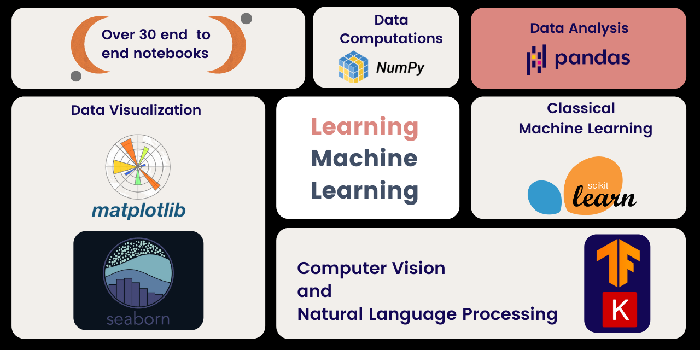

# Complete Machine Learning Package

```
🏅 Ranked as one of the top data science repositories on GitHub!
```

<p style='text-align: justify;'> <a href="https://nbviewer.jupyter.org/github/Nyandwi/machine_learning_complete"> </a> <a href="https://raw.githubusercontent.com/jupyter/design/master/logos/Badges/nbviewer_badge.svg" target="_parent"></a> <a href="https://deepnote.com/project/machinelearningcomplete-4vpZ-iGjRUeXCQpL5zcIsw/%2Fmachine_learning_complete%2F5_intro_to_machine_learning%2F5_intro_to_machine_learning.ipynb"></a> </p>


***Techniques, tools, best practices, and everything you need to to learn machine learning!***




[Complete Machine Learning Package](https://nyandwi.com/machine_learning_complete/) is a comprehensive repository containing 35 notebooks on Python programming, data manipulation, data analysis, data visualization, data cleaning, classical machine learning, Computer Vision and Natural Language Processing(NLP). 

All notebooks were created with the readers in mind. Every notebook starts with a high-level overview of any specific algorithm/concept being covered. Wherever possible, visuals are used to make things clear.

*******

## What's New 🔥

*  May 10th, 2023: Added a [comprehensive guide on MLOps](https://github.com/Nyandwi/machine_learning_complete/blob/main/010_mlops/1_mlops_guide.md). Enjoy the guide!!

* June 23th, 2022: Many people have asked how they can support the package. You can buy us a [coffee ☕️](https://www.buymeacoffee.com/jeande)

* May 18th, 2022: Complete Machine Learning Package is now available on [web](https://nyandwi.com/machine_learning_complete/). It's now easy to view all notebooks!

* April 9th, 2022: Updated [Transfer Learning with Pretrained Convolutional Neural Networks](https://github.com/Nyandwi/machine_learning_complete/blob/main/8_deep_computer_vision_with_tensorflow/3_transfer_learning_convnets.ipynb) with additional things and added further resources.

* November 25th, 2021: Updated [Fundamentals of Machine Learning](https://github.com/Nyandwi/machine_learning_complete/blob/main/5_intro_to_machine_learning/ml_fundamentals.md): Added introductory notes, ML system design workflow, and challenges of learning systems.

*******

## Tools Overview

The following are the tools that are covered in Complete Machine Learning Package. They are popular tools that most machine learning engineers and data scientists need in one way or another and day to day. 

* [Python](https://www.python.org) is a high level programming language that has got a lot of popularity in the data community and with the rapid growth of the libraries and frameworks, this is a right programming language to do ML.

* [NumPy](https://numpy.org) is a scientific computing tool used for array or matrix operations. 

* [Pandas](https://pandas.pydata.org) is a great and simple tool for analyzing and manipulating data from a variety of different sources.

* [Matplotlib](https://matplotlib.org) is a comprehensive data visualization tool used to create static, animated, and interactive visualizations in Python.

* [Seaborn](https://seaborn.pydata.org) is another data visualization tool built on top of Matplotlib which is pretty simple to use.

* [Scikit-Learn](https://scikit-learn.org/stable/): Instead of building machine learning models from scratch, Scikit-Learn makes it easy to use classical models in a few lines of code. This tool is adapted by almost the whole of the ML community and industries, from the startups to the big techs. 

* [TensorFlow](https://www.tensorflow.org) and [Keras](https://keras.io) for deep learning: TensorFlow is a popular deep learning framework used for building models suitable for different fields such as Computer Vision and Natural Language Processing. Keras is a high level neural network API that makes it easy to design deep learning models. TensorFlow and Keras have a great [community](https://discuss.tensorflow.org) and ecosystem that include tools like [TensorBoard](https://www.tensorflow.org/tensorboard), [TF Datasets](https://www.tensorflow.org/datasets), [TensorFlow Lite](https://www.tensorflow.org/lite), [TensorFlow Extended](https://www.tensorflow.org/tfx/), [TensorFlow Hub](https://www.tensorflow.org/hub), [TensorFlow.js](https://www.tensorflow.org/js), [TensorFlow GNN](https://github.com/tensorflow/gnn), and [much](https://www.tensorflow.org/resources/models-datasets) [more](https://www.tensorflow.org/resources/tools).

*******

## Complete Outline


## Part 1 - Intro to Python and Working with Data


### [0 - Intro to Python for Machine Learning](https://github.com/Nyandwi/machine_learning_complete/blob/main/0_python_for_ml/intro_to_python.ipynb)

### [1 - Data Computation With NumPy](https://nyandwi.com/machine_learning_complete/01_intro_to_Numpy_for_data_computation/)

* Creating a NumPy Array
* Selecting Data: Indexing and Slicing An Array
* Performing Mathematical and other Basic Operations
* Performing Basic Statistics
* Manipulating Data

[*You can find detailed notes about NumPy [here](https://github.com/Nyandwi/machine_learning_complete/blob/main/1_data_computations_with_numpy/detailed_notes_on_numpy.pdf)*]

### [2 - Data Manipulation with Pandas](https://nyandwi.com/machine_learning_complete/02_data_manipulation_with_pandas/)


* Basics of Pandas
   * Series and DataFrames
   * Data Indexing and Selection
   * Dealing with Missing data
   * Basic operations and Functions
   * Aggregation Methods
   * Groupby
   * Merging, Joining and Concatenate
* Beyond Dataframes: Working with CSV, and Excel
* Real World Exploratory Data Analysis (EDA)


### 3 - Data Visualization


* [Data Visualization with Matplotlib](https://nyandwi.com/machine_learning_complete/03_data_visualizations_with_matplotlib/)
* [Data Visualization with Seaborn](https://nyandwi.com/machine_learning_complete/04_data_visualization_with_seaborn/)
* [Data Visualization with Pandas](https://nyandwi.com/machine_learning_complete/05_data_visualization%20with_pandas/)

### 4 - Real World Data Exploratory Analysis and Data Preparation

* [Exploratory Data Analysis](https://nyandwi.com/machine_learning_complete/06_exploratory_data_analysis/)

* [Intro to Data Preparation](https://nyandwi.com/machine_learning_complete/07_intro_to_data_preparation/)

* [Handling Categorical Features](https://nyandwi.com/machine_learning_complete/08_encoding_categorical_features/)

* [Feature Scaling](https://nyandwi.com/machine_learning_complete/09_feature_scaling/)

* [Handling Missing Values](https://nyandwi.com/machine_learning_complete/10_handling_missing_values/)


## Part 2 - Machine Learning

### [5 - Machine Learning Fundamentals](https://nyandwi.com/machine_learning_complete/11_ml_fundamentals/)

* What is Machine Learning?
* The Difference Between Artificial Intelligence, Data Science, Machine Learning, and Deep Learning
* The Difference Between Machine Learning and Ordinary Programming
* Applications of Machine Learning
* When to Use and When not to Use Machine Learning
* Types of Machine Learning
* A Typical Machine Learning Project Workflow
* Evaluation Metrics
* The Challenges of Machine Learning Systems


### 6 - Classical Machine Learning with Scikit-Learn

* [Intro to Scikit-Learn for Machine Learning](https://nyandwi.com/machine_learning_complete/12_intro_to_sklearn/)

* [Linear Models for Regression](https://nyandwi.com/machine_learning_complete/13_linear_models_for_regression/)

* [Linear Models for Classification](https://nyandwi.com/machine_learning_complete/14_linear_models_for_classification/)

* [Support Vector Machines: Intro and Regression](https://nyandwi.com/machine_learning_complete/15_support_vector_machines_for_regression/)

* [Support Vector Machines for Classification](https://nyandwi.com/machine_learning_complete/16_support_vector_machines_for_classification/)

* [Decision Trees: Intro and Regression](https://nyandwi.com/machine_learning_complete/17_decision_trees_for_regression/)

* [Decision Trees for Classification](https://nyandwi.com/machine_learning_complete/18_decision_trees_for_classification/)

* [Random Forests: Intro and Regression](https://nyandwi.com/machine_learning_complete/19_random_forests_for_regression/)

* [Random Forests for Classification](https://nyandwi.com/machine_learning_complete/20_random_forests_for_classification/)

* [Beyond Random Forests: More Ensemble Models](https://nyandwi.com/machine_learning_complete/21_ensemble_models/)

* [Intro to Unsupervised Learning with KMeans Clustering](https://nyandwi.com/machine_learning_complete/22_intro_to_unsupervised_learning_with_kmeans_clustering/)

* [A Practical Intro to Principal Component Analysis](https://nyandwi.com/machine_learning_complete/23_a_practical_intro_to_principal_components_analysis/)


## Part 3 - Deep Learning

### 7 - Intro to Artificial Neural Networks and TensorFlow

* [Intro to Articial Neural Networks](https://nyandwi.com/machine_learning_complete/24_intro_to_neural_networks/)

    * Why Deep Learning
    * A Single Layer Neural Network
    * Activation Functions
    * Types of Deep Learning Architectures
        * Densely Connected Networks
        * Convolutional Neural Networks
        * Recurrent Neural Networks
        * Transformers
        
    * Challenges in Training Deep Neural Networks
    
* [Intro to TensorFlow for Deep Learning](https://nyandwi.com/machine_learning_complete/25_intro_to_tensorflow_for_deeplearning/)

    * What is TensorFlow?
    * TensorFlow Model APIs
    * A Quick Tour into TensorFlow Ecosystem
    * Basics of Tensors
    
* [Neural Networks for Regression with TensorFlow](https://nyandwi.com/machine_learning_complete/26_neural_networks_for_regresion_with_tensorflow/)

* [Neural Networks for Classification with TensorFlow](https://nyandwi.com/machine_learning_complete/27_neural_networks_for_classification_with_tensorflow/)


### 8 - Deep Computer Vision with TensorFlow
 
* [Intro to Computer Vision with Convolutional Neural Networks(CNNs)](https://nyandwi.com/machine_learning_complete/28_intro_to_computer_vision_and_cnn/)

    * Intro to Computer Vision and CNNs
       * What is Convolutional Neural Networks?
       * A Typical Architecture of Convolutional Neural Networks
    * Coding ConvNets: Image Classification
    
* [ConvNets for Real World Data and Image Augmentation](https://nyandwi.com/machine_learning_complete/29_cnn_for_real_world_data_and_image_augmentation/#contents)

    * Intro - Real World Datasets and Data Augmentation
    * Getting Started: Real World Datasets and Overfitting
    * Image Augmentation with Keras Image Augmentation Layers
* [Transfer Learning with Pretrained Convolutional Neural Networks](https://nyandwi.com/machine_learning_complete/30_cnn_architectures_and_transfer_learning/)

    * Motivation for Transfer Learning
    * Introduction to Transfer Learning
    * A Typical Flow of Transfer Learning
    * Quick Image Classification with Pretrained Models
    * Transfer Learning and FineTuning in Practice
    * Quick Image Classification and Transfer Learning with TensorFlow Hub

    [Updated notebook of Transfer Learning is found [here]((https://github.com/Nyandwi/machine_learning_complete/blob/main/8_deep_computer_vision_with_tensorflow/3_transfer_learning_convnets.ipynb))]

### 9 - Natural Language Processing with TensorFlow

* [Intro to NLP and Text Processing with TensorFlow](https://nyandwi.com/machine_learning_complete/31_intro_to_nlp_and_text_preprocessing/)

    * Intro to Natural Language Processing
    * Text Processing with TensorFlow
    * Using TextVectorization Layer
* [Using Word Embeddings to Represent Texts](https://nyandwi.com/machine_learning_complete/32_using_word_embeddings_to_represent_texts/)

    * Intro to Word Embeddings
    * Embedding In Practice
    * Using Pretrained Embeddings
* [Recurrent Neural Networks (RNNs)](https://nyandwi.com/machine_learning_complete/33_recurrent_neural_networks/)

    * Intro to Recurrent Neural Networks
    * Simple RNNs In Practice: Movies Sentiment Analysis
    * Intro to Long Short Terms Memories
    * LSTMs in Practice : News Classification
    
* [Using Convolutional Neural Networks for Texts Classification](https://nyandwi.com/machine_learning_complete/34_using_cnns_and_rnns_for_texts_classification/)

    * Intro Convolutional Neural Networks for Texts
    * CNN for Texts in Practice: News Classification
    * Combining ConvNets and RNNs
    
* [Using Pretrained BERT for Text Classification](https://nyandwi.com/machine_learning_complete/35_using_pretrained_bert_for_text_classification/)

    * Intro to BERT
    * In Practice: Finetuning a Pretrained BERT

*******


## Used Datasets

Many of the datasets used for this repository are from the following sources: 

* [UC OpenML](https://www.openml.org)
* [Seaborn Datasets](https://github.com/mwaskom/seaborn-data)
* [Scikit-Learn datasets](https://scikit-learn.org/stable/datasets.html)
* [Kaggle](https://www.kaggle.com/datasets)
* [TensorFlow datasets](https://www.tensorflow.org/datasets/catalog/overview)

*******

## Further Machine Learning Resources

Machine Learning community is very vibrant. Complete Machine Learning Package can get you started, but it's not enough. Fortunately, there are many faboulous learning resources, some of which are paid or freely available. Here is a list of courses that are often recommended by many people. Note that they are not listed in an order they are to be taken.

### Courses

* **Machine Learning by Coursera**: This course was taught by Andrew Ng. It is one of the most popular machine learning courses, it has been taken by over 4M of people. The course focuses more about the fundamentals of machine learning techniques and algorithms. It is free on [Coursera](https://www.coursera.org/learn/machine-learning). 

* **Deep Learning Specialization**: Also tought by Andrew Ng., Deep Learning Specialization is also a foundations based course. It teaches a decent foundations of major deep learning architectures such as convolutional neural networks and recurrent neural networks. The full course can be [audited on Coursera](https://www.coursera.org/specializations/deep-learning), or watch freely on [Youtube](https://www.youtube.com/playlist?list=PLkDaE6sCZn6Ec-XTbcX1uRg2_u4xOEky0).

* **MIT Intro to Deep Learning**: This course provide the foundations of deep learning in resonably short period of time. Each lecture is one hour or less, but the materials are still the best in classs. Check the course page [here](http://introtodeeplearning.com), and lecture videos [here](https://www.youtube.com/watch?v=AjtX1N_VT9E&list=PLtBw6njQRU-rwp5__7C0oIVt26ZgjG9NI&index=4).

* **MIT Introduction to Data-Centric AI**: This is the first-ever course on DCAI. This class covers algorithms to find and fix common issues in ML data and to construct better datasets, concentrating on data used in supervised learning tasks like classification. All material taught in this course is highly practical, focused on impactful aspects of real-world ML applications, rather than mathematical details of how particular models work. You can take this course to learn practical techniques not covered in most ML classes, which will help mitigate the “garbage in, garbage out” problem that plagues many real-world ML applications. Check out the course page [here](https://dcai.csail.mit.edu/), lecture videos [here](https://www.youtube.com/watch?v=ayzOzZGHZy4&list=PLnSYPjg2dHQKdig0vVbN-ZnEU0yNJ1mo5), and lab assignments [here](https://github.com/dcai-course/dcai-lab).

* **NYU Deep Learning Spring 2021**: Taught at NYU by Yann LeCun, Alfredo Canziani, this course is one of the most creative courses out there. The materials are presented in amazing way. Check the lecture videos [here](https://www.youtube.com/playlist?list=PLLHTzKZzVU9e6xUfG10TkTWApKSZCzuBI), and the course repo [here](https://github.com/Atcold/NYU-DLSP21). 

* **CS231N: Convolutional Neural Networks for Visual Recognition by Stanford**: CS231N is one of the best deep learning and computer vision courses. The 2017 version was taught by Fei-Fei Li, Justin Johnson and Serena Yeung. The [2016 version](http://cs231n.stanford.edu/2016/) was taught by Fei-Fei, Johnson and Andrej Karpathy. See 2017 lecture videos [here](https://www.youtube.com/watch?v=vT1JzLTH4G4&list=PLzUTmXVwsnXod6WNdg57Yc3zFx_f-RYsq&index=1&t=457s), and other materials [here](http://cs231n.stanford.edu). 

* **CS224N: Natural Language Processing with Deep Learning by Stanford**: If you are interested in Natural Language Processing, this is a great course to take. It is taught by Christopher Manning, one of the world class NLP stars. See the lecture videos [here](https://www.youtube.com/playlist?list=PLU40WL8Ol94IJzQtileLTqGZuXtGlLMP_). 

* **Practical Deep Learning for Coders by fast.ai**: This is also an intensive deep learning course that cover the whole spectrum of deep learning architectures and techniques. The [lecture videos](https://course.fast.ai/videos/?lesson=1) and other resources such as [notebooks](https://github.com/fastai/fastbook) are the [course page](https://course.fast.ai). 

* **Machine Learning Engineering for Production (MLOps) Specialization**: Taught by Andrew Ng., Laurence Moroney, and Robert Crowe, this is one of the best ML engineering course. It teaches how to design end to end machine learning production systems, building efficient data and modelling pipelines, and deploying models in production. You can find the course on [Coursera](https://www.coursera.org/specializations/machine-learning-engineering-for-production-mlops#about) and other course materials on [Github](https://github.com/https-deeplearning-ai/machine-learning-engineering-for-production-public). 

* **Full Stack Deep Learning**: While the majority of machine learning courses focuses on modelling, this course focuses on shipping machine learning systems. It teaches how to design machine learning projects, data management(storage, access, processing, versioning, and labeling), training, debugging, and deploying machine learning models. See 2021 version [here](https://fullstackdeeplearning.com/spring2021/) and 2019 [here](https://fall2019.fullstackdeeplearning.com). You can also skim through the [project showcases](https://fullstackdeeplearning.com/spring2021/projects/) to see the kind of the courses outcomes through learners projects.


### Books

Below are some few awesome machine learning books. 

* **The Hundred-Page Machine Learning Book**: Authored by Andriy Burkov, this is one of the shortest but concise and well written book that you will ever find on the internet. You can read the book for free [here](http://themlbook.com/wiki/doku.php).

* **Machine Learning Engineering**: Also authored by Andriy Burkov, this is another great machine learning book that uncover each step of machine learning workflow, from data collection, preparation....to model serving and maintenance. The book is also free [here](http://www.mlebook.com/wiki/doku.php). 

* **Machine Learning Yearning**: Authored by Andrew Ng., the book contains various strategies for building effective learning systems. It is partitioned into small parts which makes it easy to read and it is not sorely for machine learning engineers. Anyone working with data science and machine learning teams can find the book helpful. The official book is available [here](https://www.deeplearning.ai/programs/) for free, but you can read or download it [here](https://github.com/ajaymache/machine-learning-yearning) without requiring to sign up. 

* **Hands-on Machine Learning with Scikit-Learn, Keras, and TensorFlow**: Authored by Aurelion Geron, this is one of the best machine learning books. It is clearly written and full of ideas and best practices. You can get the book [here](https://www.oreilly.com/library/view/hands-on-machine-learning/9781492032632/), or see its repository [here](https://github.com/ageron/handson-ml2). 

* **Deep Learning**: Authored by 3 deep learning legends, Ian Goodfellow and Yoshua Bengio and Aaron Courville, this is one of the great deep learning books that is freely available. You can get it [here](https://www.deeplearningbook.org). 

* **Deep Learning with Python**: Authored by Francois Chollet, The Keras designer, this is a very comprehensive deep learning book. You can get the book [here](https://www.manning.com/books/deep-learning-with-python-second-edition), and the book repo [here](https://github.com/fchollet/deep-learning-with-python-notebooks). 

* **Dive into Deep Learning**: This is also a great deep learning book that is freely available. The book uses both PyTorch and TensorFlow. You can read the entire book [here](https://d2l.ai/index.html).

* **Neural Networks and Deep Learning**: This is also another great deep learning online book by Michael Nielsen. You can read the entire book [here](http://neuralnetworksanddeeplearning.com).

If you are interested in more machine learning and deep learning resources, you can find them [here](https://ludwigstumpp.com/ml-starter-kit), [here](https://deep-learning-drizzle.github.io) and [here](https://github.com/dair-ai/ML-YouTube-Courses)

*******

## Citing Complete ML Package

```
@article{Nyandwi2021MLPackage,
    title = "Complete Machine Learning Package",
    author = "Nyandwi, Jean de Dieu",
    journal = "GitHub",
    year = "2021",
    url = "https://nyandwi.com/machine_learning_complete",
}
```
******

This repository was created by [Jean de Dieu Nyandwi](https://nyandwi.com). You can find him on [Twitter](https://twitter.com/jeande_d), [LinkedIn](https://linkedin.com/in/nyandwi), [Medium](https://jeande.medium.com), and [Instagram](https://www.instagram.com/nyandwi.de).


